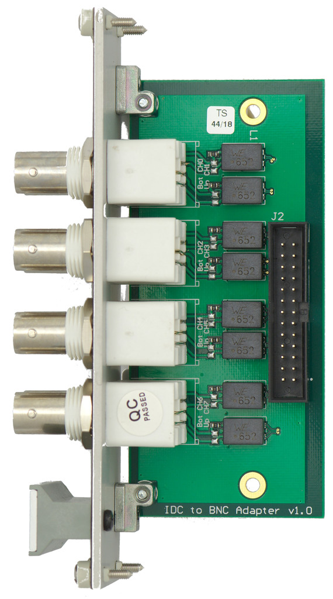

### This wiki is no more updated. Up to date version is here: https://github.com/sinara-hw/BNC_IDC/wiki

Adapter for routing analog potentials from Zotino IDC headers to BNC. Source is [here](https://github.com/m-labs/sinara/tree/master/ARTIQ_ALTIUM/EEMs/Zotino_BNC_Adapter). 

