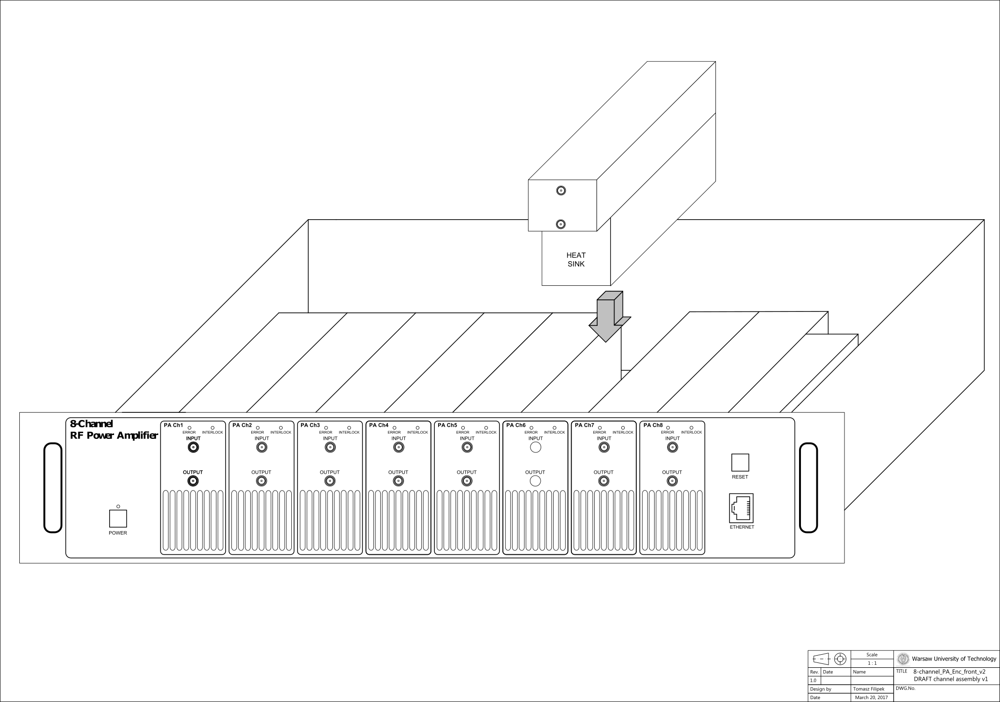

The project was moved here: https://github.com/sinara-foundation/Booster/wiki
This page will not be updated.

Booster is an eight channel RF power amplifier, providing up to 4W (1dB compression) between 40MHz and 500MHz. Mounted in a compact 2U thick 19'' chassis, it is optimised for low cost and low power consumption, while providing good RF performance. It provides full interlocking and logging via a flexible ethernet-based remote interface.
 

## Overview

- **Bandwidth**: 40MHz to 500MHz
- **P1db**: 36dBm min
- **Max CW output power**: 38dBm min
- **Gain @1dB compression**: 40dB ±1dB typ (±1.5dB max)
- **IP3**: 48dBm min
- **Crosstalk**: -80dB max
- **Input/output VSWR**: 1.5:1 max
- **Power supply**: 100VAC-240VAC, 50Hz-60Hz
- **Total power efficiency**: >35% at 1dB saturation from mains to RF
- **Cost**: €6000

## Features

- Text-based (SCPI-like) Ethernet interface for monitoring and configuration
- Protection circuit shuts down individual channels in case of: input power overload; reverse power overload; channel failure. Protection tripped indicator LED for each channel on the front panel, also readable via Ethernet. Protection circuit may be reset either using push-button on front panel or via Ethernet. The input power overload threshold is user-adjustable on a per-channel basis using the Ethernet interface. This allows users to ensure that the maximum power rating of sensitive loads, such as AOMs cannot be exceeded accidentally. 
- Per-channel remote monitoring of: forward and reverse power; temperature; current and voltage. 
- Remote shut down of individual channels via Ethernet, for example to avoid power dissipation from unused channels.
- Each channel is an independent unit for easy field replacement

## Firmware Update
### Linux 

Required libraries: **dfu-util**
* Download update.dfu file from github
* Place jumper into DFU pins on PCB and connect USB cable
* Run **dfu-util -l** and mark down alt number for Internal Flash option

> dfu-util 0.9
> 
> Copyright 2005-2009 Weston Schmidt, Harald Welte and OpenMoko Inc.
> Copyright 2010-2016 Tormod Volden and Stefan Schmidt
> This program is Free Software and has ABSOLUTELY NO WARRANTY
> Please report bugs to http://sourceforge.net/p/dfu-util/tickets/
> 
> Found DFU: [0483:df11] ver=2200, devnum=29, cfg=1, intf=0, path="3-5", alt=3, name="@Device 
Feature/0xFFFF0000/01*004 e", serial="377533563436"  
> Found DFU: [0483:df11] ver=2200, devnum=29, cfg=1, intf=0, path="3-5", alt=2, name="@OTP Memory /0x1FFF7800/01*512 e,01*016 e", serial="377533563436"  
> Found DFU: [0483:df11] ver=2200, devnum=29, cfg=1, intf=0, path="3-5", alt=1, name="@Option Bytes  /0x1FFFC000/01*016 e", serial="377533563436"  
> Found DFU: [0483:df11] ver=2200, devnum=29, cfg=1, intf=0, path="3-5", **alt=0**, name="@Internal Flash /0x08000000/04*016Kg,01*064Kg,07*128Kg", serial="377533563436"

* Run command **dfu-util -D update.dfu -a 0**, with selected memory region alt number
* Wait for operation to complete, then remove jumper and reboot device

### Windows
* Download application [DfuSe Demo](http://www.st.com/en/development-tools/stsw-stm32080.html)
* Download firmware update file from github
* Place jumper into DFU pins on PCB and connect USB cable
* Run DfuSeDemo
* Select **Internal Flash** from **Select target(s)** menu.
* In **Upgrade or Verify Action** click **Choose** and select firmware update file
* Click **Yes** in dialog box
* Wait for operation to complete, then remove jumper and reboot device

## SCPI Network commands

* **CHANnel:ENABle <mask>** - enable power for selected channel (channel mask is binary representation for each channel eg. 00000011 = 3 enables channel 0 and 1)
* **CHANnel:DISABle <mask>** - disable power for selected channel (channel mask is binary representation for each channel eg. 00000011 = 3 enables channel 0 and 1)
* **CHANnel:START <mask>** - enable input switch for selected channel (channel mask is binary representation for each channel eg. 00000011 = 3 enables channel 0 and 1)
* **CHANnel:STOP <mask>** - disable input switch for selected channel (channel mask is binary representation for each channel eg. 00000011 = 3 enables channel 0 and 1)
* **CHANnel:STATus?** - return status code for each channel (bit mask)
> enabled = 1  
> switch enabled = 2  
> channel alert = 4  
> channel overvoltage = 8  
* **CHANnel:MEASure:VOLTage?** - return RF power measurements for each channel (16 values = 2 per channel)
* **CHANnel:MEASure:CURRent?** - return channel power measurements for negative voltage, 8V and 29V (24 values = 3 per channel)