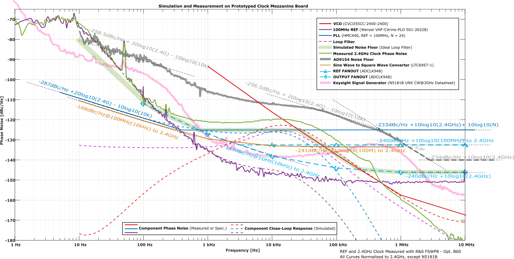

# Overview

Clock mezzanines generate high-quality RF/microwave signals for use as data converter clocks and local oscillators (LOs) by phase-locking low-noise VCOs to a supplied reference source. They mount on a suitable carrier, such as [Baikal](Baikal), which supplies global signals to all RTMs in a uTCA.4 rack, or to an individual RTM, such as [Sayma](Sayma), for local frequency generation.

# Features and specification

* Reference input from carrier PCB via 2xSMPs, typically 100MHz AC-coupled differential 3V3 PECL square-wave.
* Two independent phase-locked loops (PLLs), one typically used as one data converter clock (CLK) and one as a high-frequency reference/local oscillator (REF_LO). Outputs are AC coupled 3V3 PECL square-waves provided as differential signals over 2xSMPs.
* PLL lock indicators accessible via TTLs
* PLL multiplication factors (output frequencies) accessible from carrier via I2C
* Auxiliary CLK input from MMCX connector on top of PCB with isolated ground. Typical input is 50Ohm single-ended, +10dBm. Switching between on-board PLL and auxiliary input using integrated ultra-low noise clock mux controllable from carrier.

* Digital/power: copy from AFE specification, and specify pins for PLL locked indicators (high-locked) and mux

# Mezzanines

## Template mezzanine

Used for thermal and electrical testing of carriers, such as Sayma and Baikal, and as a template for designing clock mezzanines.

The design files are located in [ARTIQ_ALTIUM/PCB_mezzanine_clock_template](https://github.com/m-labs/sinara/tree/master/ARTIQ_ALTIUM/PCB_mezzanine_clock_template), the schematic is [here](https://github.com/m-labs/sinara/blob/master/ARTIQ_ALTIUM/PCB_mezzanine_clock_template/mezzanine_clock_template.PDF).

## Low phase noise clock mezzanine

An ultra-low noise, dual-output fixed-frequency signal generator.

The design files are located in [ARTIQ_ALTIUM/PCB_mezzanine_clock](https://github.com/m-labs/sinara/tree/master/ARTIQ_ALTIUM/PCB_mezzanine_clock), the schematic is [here](https://github.com/m-labs/sinara/blob/master/ARTIQ_ALTIUM/PCB_mezzanine_clock_template/mezzanine_clock.PDF).

Specification:

* PLL: HMC440
* VCOs: Crystek CVCO55CC family of narrow-band VCOs
* Output range for 100MHz input: 400MHz to 3.2GHz, limited by available VCOs and HMC440 multiplication factor
* PLL multiplication factors (output frequencies) fixed by component section, but readable from carrier via I2C
* To do: measure long-term phase stability

### Loop filters

To do: add component choices and noise models (+ measurements where available) for important output frequencies.

### Prototype

Comments about this design:

* At very low frequencies we are probably limited by the phase noise meter (R&S FSWP8 - Opt. B60)
* This design is really overkill for use as a DAC clock, since the phase noise is far below the AD9154's noise floor at all frequencies. However, this low noise may be important for generating LOs
* The phase noise of this device is comparable to the noise from a state-of-the-art commercially available synth
* At low frequencies, the noise is dominated by the reference source, even for an extremely good reference.
* Ignoring the reference noise: at most frequencies, the noise floor is limited (or close to limited) by the clock distribution network, so no significant improvement is possible without re-designing the clock distribution chain
