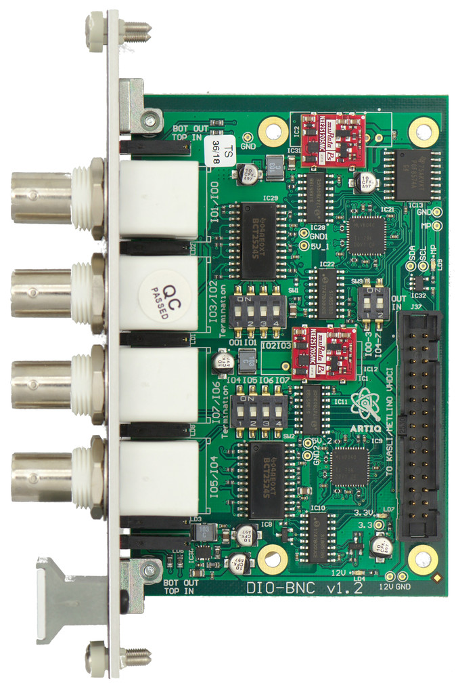

# The project was moved here: https://github.com/sinara-hw/DIO_BNC/wiki/DIO_BNC

# DIO_BNC 8 channel isolated digital input/output EEM

Extension module (EEM) supplying 8 digital IOs via front-panel BNCs.

- Occupies one EEM port
- Two banks of four channels each
- Each bank with individual ground isolation
- Per-bank switchable direction via on-board switches or I2C
- Per-channel switchable 50 Ohm termination with LED indicators
- Output channels can supply >2V into 50 Ohm loads
- Output channel impedance: 50 Ohm
- Short circuit tolerance: infinite
- Minimum pulse width: 3ns
- Max 150 MHz toggle rate with 50% duty cycle
- IO direction switched in groups of 4 channels
- Panel width: 8HP

