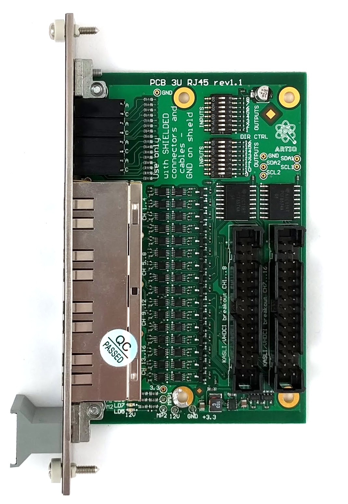

# Project was moved here: https://github.com/sinara-hw/DIO_RJ45/wiki/DIO_RJ45

Extension module supplying 16 LVDS pairs via 4 front-panel RJ45 connectors. This board connects to up to two EEM headers but single-header operation is also possible, with limited number of 8 IOs.

Each RJ45 supplies 4 3V3 LVCMOS DIOs. The direction (input/output) is individually selectable for each signal via I2C or on-board switches. Outputs are intended to drive 100Ohm loads (LVDS is short-circuit protected), inputs are 100Ohm terminated. 
The connectors dedicate all 8 pins to LVDS signals, ground is on the connector shield so ** only shielded Ethernet cat 6 **  shielded cables are allowed.
Maximum verified operating frequency is 150MHz due to TTL generator limitation. IO buffers used in the design permit operation with much higher frequency.

 
RJ45 pins:

| Function | Comment    | Pin(s) | pin designation if used for SPI | 
| -------- | ---------- | ------ | ------- | 
| GND      |            | shield | | |
| LDVS_1    | LVDS, bi-directional | 1 (P), 2 (N) |  SCLK, clock-capable |
| LDVS_2    | LVDS, bi-directional  | 4 (P), 5 (N) | MOSI |
| LDVS_3    | LVDS, bi-directional  | 3 (P), 6 (N) | MISO | 
| LDVS_4    | LVDS, bi-directional  | 7 (P), 8 (N) | CS |

