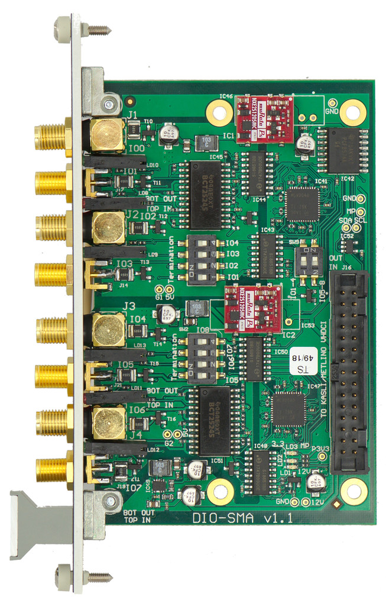

# Project was moved here: https://github.com/sinara-hw/DIO_SMA/wiki/DIO_SMA

Extension module supplying 8 digital IOs via front-panel SMAs. The IOs are divided into two banks of 4, with per-bank ground isolation. The direction (input/output) and termination (high-Z/50R) is selectable on a per-channel basis via I2C or on-board switches. Outputs can supply 5V into 25Ohm, and can tolerate an indefinite short-circuit to ground.
Features:
- selectable 50Ohm termination with LED indicators
- min pulse width 3ns, 
- max 150MHz toggle rate with 50% duty cycle
- IO direction switched in groups of 4 channels
- panel width: 4HP

