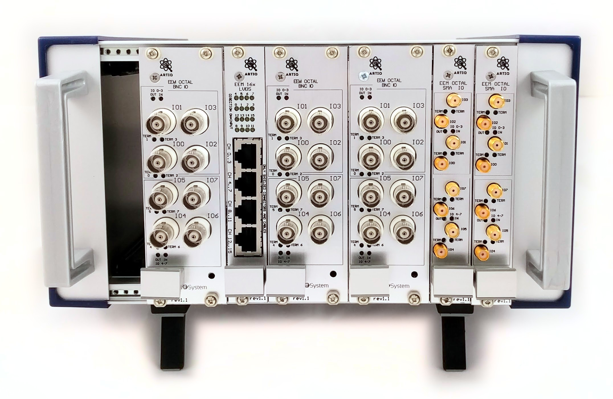
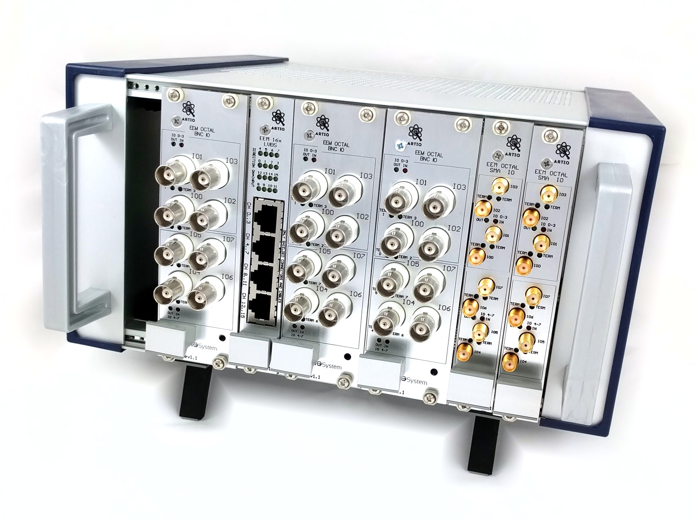

# Eurocard Extension Modules (v1.0)

Eurocard Extension Module (EEM) is a Sinara standard for low-cost, low-bandwidth peripherals that are controlled by ARTIQ DRTIO.

EEM peripherals are supplied with power and a digital interface (ARTIQ DRTIO) from an [EEM Carrier](#eem-carriers), such as [Kasli](Kasli), via ribbon cables using the [EEM Connector](#eem-connectors) interface. A future revision of [EEM v2](EEM-v2) may include backplane.

# Small system example

# EEM Carriers

EEM Carriers provide [EEM Connectors](#eem-connectors) to supply EEM peripherals with power and digital IO. Presently, Sinara includes two EEM Carriers:
- [Kasli Carrier](Kasli) can serve as a stand-alone ARTIQ Master that generates DRTIO signals
- [VHDCI Carrier](VHDCICarrier) interfaces with Sayma or Metlino boards that generate DRTIO signals

# EEM Connectors

EEM connectors provide a standardised means of connecting EEM peripherals to a carrier, such as [Kasli](Kasli), which provides power and real-time digital IO (DRTIO).

Connectors are 2x15 100mil pitch male pin-header (pinout below). Wiring between boards is typically done using ribbon cable (50mil wire pitch).

Connector pinout:

| Function | Comment    | Pin(s) | pin designation if used for SPI | RJ45 SPI |
| -------- | ---------- | ------ | ------- | ----- |
| GND      |            | 1, 4, 7, 10, 13, 16, 19, 22, 25 | | |
| +12V     | 2A max (5A max for all EEM+Kasli/VHDCI together) | 28, 29 | | |
| +3V3     | 20mA max, managmenet power for EEPROMs etc | 30 | | |
| I2C      | 3V3 LVCMOS | 26 (SDA), 27 (SCL) | | |
| LDVS_1    | LVDS, bi-directional | 2 (P), 3 (N) | SCLK0, clock-capable | SCLK0, clock-capable |
| LDVS_2    | LVDS, bi-directional  | 5 (P), 6 (N) | MOSI | MOSI0 |
| LDVS_3    | LVDS, bi-directional  | 8 (P), 9 (N) | MISO | MISO0 |
| LDVS_4    | LVDS, bi-directional  | 11 (P), 12 (N) | CS0 | CS0 |
| LDVS_5    | LVDS, bi-directional | 14 (P), 15 (N) | CS1 | SCLK1 |
| LDVS_6    | LVDS, bi-directional | 17 (P), 18 (N) | | MOSI1 |
| LDVS_7    | LVDS, bi-directional | 20 (P), 21 (N) | |MISO1 |
| LDVS_8    | LVDS, bi-directional | 23 (P), 24 (N) | | CS1 |

| | odd | even | |
| ---: | ---: | :--- | :--- |
| 1 | GND | 0P | 2 |
| 3 | 0N | GND | 4 |
| 5 | 1P | 1N | 6 |
| 7 | GND | 2P | 8 |
| 9 | 2N | GND | 10 |
| 11 | 3P | 3N | 12 |
| 13 | GND | 4P | 14 |
| 15 | 4N | GND | 16 |
| 17 | 5P | 5N | 18 |
| 19 | GND | 6P | 20 |
| 21 | 6N | GND | 22 |
| 23 | 7P | 7N | 24 |
| 25 | GND | SDA | 26 |
| 27 | SCL | 12V | 28 |
| 29 | 12V | MP | 30 |

LVDS is compatible with 1.8V, 2.5 and 3.3V bank supply.
Metlino utilises 1.8V FPGA bank supply, while Kasli utilises 2.5V supply.

Each EEM peripheral has an EEPROM on its I2C bus for identification.

Digikey has those 30 pin IDC ribbons as assemblies [M3DDA-3018J-ND](https://www.digikey.com/short/q8bhz2).
The use of the strain relief is debatable. It increases assembly height beyond 4HP.

## EEM Connector Protocol

Multiple digital IO protocols are supported for the LVDS lines on each EEM Connector.
Protocol choice is baked-in when the ARTIQ Master FPGA's bitstream is compiled.

  * TTLs, input, output, bidirectional
  * SPI
    * SPI Phys have the pin assignment: SCLK, MOSI, MISO, CS in that order.
  * NU-Servo fast ADC/DDS/PID
  * CameraLink

See [ARTIQ #823](https://github.com/m-labs/artiq/issues/823) for the bitstream and `device_db` building infrastructure requirements.

The old idea of having a restricted set of protocols that could be chosen at
runtime (see [issue #164](https://github.com/m-labs/sinara/issues/164) for discussion) has been abandoned.

# EEM Mechanical

EEM peripheral PCBs are

- 100 mm tall
- up to 160 mm long
- card pitch is 12 HP ("wide") or 4 HP ("narrow").

# Thermal/Power

A 10x16 cm board, standing upright can safely dissipate about 5 W through natural convection. Boards dissipating significantly more will likely need forced air flow.

A board can draw up to 2A (limited by EEM connector and ribbon cable). The sum of all boards can draw up to 5A (limited by the barrel connector).

[Mean Well GSM90B12-P1M
](https://www.digikey.de/short/q85v94) are some decent power supplies. They are floating (IEC 320-C8 cord with the narrow Euro plug, doubly insulated Class II devices), "medical", and on the lower side in terms of ripple.

[Sanken HWB](https://www.digikey.de/short/q85vrz) are some "enclosed" chassis-mount modules that have extremely low ripple for an SMPS and high efficiency.

# EEM Chassis/Enclosures

EEM PCBs are designed to mount either in a stand-alone enclosure, or in a 19" rack.

Standard open 3U DIN sub-racks/crates ("Baugruppenträger") [Fischer 10025291](https://www.reichelt.de/Baugruppentraeger/BGT-384-180/3/index.html?ACTION=3&GROUPID=7756&ARTICLE=33986&SEARCH=%252A&START=0&OFFSET=100&) work well. As do small cases like [PROMA 133061 10"](https://www.reichelt.de/Baugruppentraeger/GEH-SG-1-10/3/index.html?ACTION=3&GROUPID=7756&ARTICLE=50437&SEARCH=proma&START=0&OFFSET=100&) or [PROMA 133063 19"](https://www.reichelt.de/Baugruppentraeger/GEH-SG-1-19/3/index.html?ACTION=3&GROUPID=7756&ARTICLE=50439&SEARCH=proma&START=0&OFFSET=100&)

Joe's system ([Issue 188](https://github.com/m-labs/sinara/issues/188)):

| Descriptor | Manufacturer | Cost | P/N | Qty |Extended |
|------------|--------------|------|-----|-----|------|
| fan tray [1]| Tripp Lite | [$130/ea](https://www.amazon.com/Enclosure-Cabinet-Cooling-High-Performance-SRFAN1U/dp/B016A4CP3E) | SRFAN1U | 1 | Rack Enclosure Server Cabinet 1U Cooling Fan Tray 3 120V |
| rack | Vector Electronics [0] | [$225/ea](http://www.vectorelect.com) | CCA72-84-01 | 1 | pre-assembled 3U rack |
| card guides | Vector Electronics [0] | [$19/ea](http://www.gerberelec.com/) | CG3-160/12 | 4 | 160 mm card guide pkg of 12 |
| 1U blanks | Rosewill | [$15/ea](https://www.amazon.com/Rosewill-Horizontal-Vented-Cabinet-RSA-1UPA003/dp/B06XCHJY7J) | RSA-1UPA003 | 2 | 1U 19 Inch Horizontal Metal Blank Panel with Vented slots |

[0] may be ordered direct from Vector
- 11115 Vanowen Street; North Hollywood, CA  91605
- www.vectorelect.com
- 800-423-5659
