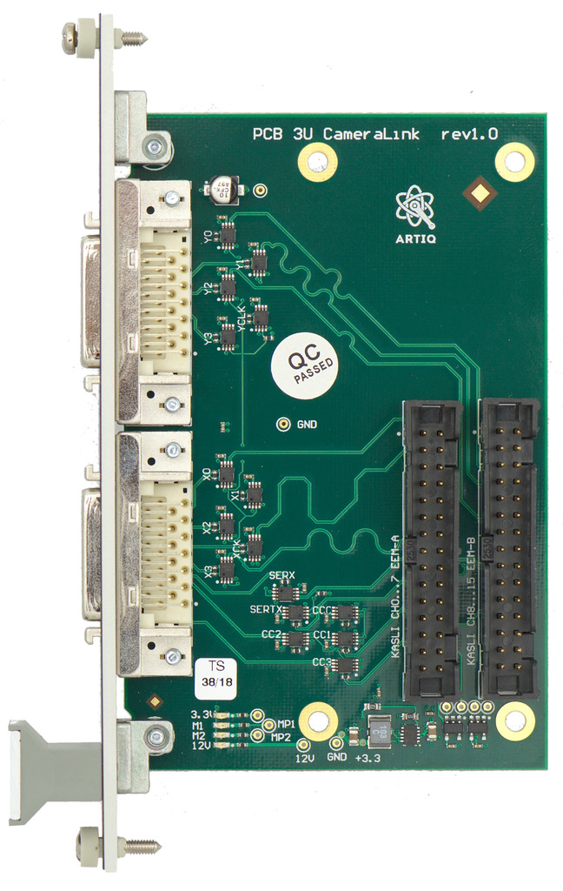

This page is no more updated. Wiki was moved here: https://github.com/sinara-hw/Grabber/wiki

# Grabber camera frame grabber extension

Grabber is a Camera frame grabber input module.

Funded. The design of the hardware is complete, specification of the gateware is
continuing. Lead is with Christian's Hannover/PTB group.

Time frame estimate is May 2018.

## Board drawing

## Specification

Previously discussed in [#156](https://github.com/m-labs/sinara/issues/156) and
[#595](https://github.com/m-labs/artiq/issues/595).

Target cameras are the typical scientific (EM)CCD cameras with CameraLink port, somthing like:

* [Andor iXon Ultra/Life EMCCD 888/897](http://www.andor.com/pdfs/specifications/Andor_iXon_ULTRA_EMCCD_Specifications.pdf)
* [Andor X3](https://www.nikoninstruments.com/content/download/14521/329658/file/Andor_iXon3_EMCCD_BrochureA.pdf).

See also Andor Technical Note [iXon Ultra Camera Link Output for Direct Data
Access](http://www.andor.com/LearningPdf.aspx?id=133).

## Overview

[CameraLink](https://en.wikipedia.org/wiki/Camera_Link) is an output of digital cameras that emits the already digitized pixel data at high speed and low latency before and independent of it being transferred over USB or Ethernet.

A **Base** CameraLink has a clock, four data, four control and two serial
communications lines. The clock and data lines carry the frame data. They also
carry FVAL/DVAL/LVAL (frame, data, line valid flags to describe the shape of
the frame and validity of the data). Base transfers 28 bits (4 control and 24 data) per clock cycle. Maximum clock frequency is 85 MHz, line rate on the data lines is 85 MHz * 7 = 595 MHz. We expect that this will survive at least 20 cm of ribbon wire and two IDC connectors.

Andor cameras only run at 40 MHz clock. That's a 280 MHz line rate and 40 MHz pixel clock (the 16 bits/pixel are just zero padded to 24 bits).

The control lines can be used for various purposes (e.g. triggering) and the serial
communication link can configure and monitor the camera.
The serial link could even be translated to I2C freeing up two more pins.

**Note** that on the Andor cameras the serial control link is not implemented and the use of the control lines is unknown.

**Medium** or **Full** CameraLinks use more clock and data lines.

The interface would be 3-tap (a.k.a. *Base*) Camera Link with MDR-26 (Miniature Delta Ribbon). There is also SDR-26 (Shrunk D Ribbon) with a smaller connector. If the space on the board is limited, one could choose SDR as there are MDR-SDR cables readily available.

Signal standard is LVDS.
The extension module should be a dumb adapter.

## EEM mapping

Base CameraLink will consume one EEM connector (EEM0) and needs IOSERDES on four and CC on one pin.
Medium and CameraLink requires one more EEM (EEM1). Full CameraLink is not
supported.

* EEM0 (Base minus Control 3 and Serial Comm)
  * XCLK (EEM0-0)
  * X0 to X3 (EEM0-1 to 4)
  * Control 0-2 (EEM0-5 to 7)
* EEM1 (Medium, Control 3, Serial Comm)
  * YCLK (EEM1-0)
  * Y0 to Y3 (EEM1-1 to 4)
  * Tx/Rx: Serial (EEM1-5 and 6)
  * Control 3 (EEM1-7)

Power over CameraLink (PoCL) is not supported.

## Gateware concept

* Serial Comms is not supported as it is dead on the cameras targeted.
* Control lines are not supported (but could easily be mapped to standard TTL
  Phys) as they are without function on the cameras targeted.
* Clock speeds and frame format will target the 40 MHz, M=16 bit grey,
  Base CameraLink (Andor) use case.
* Needs 1:7 PLL on the clock input for the 1:7 SERDES.
* The full frame data would be ~16 Mbit. We don't want to store that on FPGA nor
  do we want to build the DRAM writer for it. Full frame data is also readily
  available on the "standard" link (USB or Ethernet) through the computer and
  e.g. Andor SDK, and a good shim layer in Python (Oxford?). For alignment, ion finding and definition of the ROIs use the computer.
* The gateware will automatically discover the frame dimensions from
  FVAL/LVAL/DVAL and run/clear row/column coordinate counters accordingly.
* Frame dimensions will be limited to K=12 bits (4096 rows and columns).
* To process the data, it is streamed through and N>=16 "ROI engines". N=32 if
  possible.
* Each ROI engine gates on one rectangular pixel region and accumulates
  pixel values for each frame. The ROI engines operate independently and can be
  overlapping. The accumulators need to be `2*K + M = 36` bit wide.
* After the frame, the accumulated value is pushed as an RTIO input event if
  the ROI region is enabled. One RTIO input channel for all ROI engines.
* The ROI engines sensitivity areas are configured through a single RTIO port
  (or even through slower non-RTIO/out-of-band means). N addresses, each
  4x12 bits ROI data.
* The RTIO input submission is gated (per ROI engine) by a N-bit gate RTIO port,
  analogous to the TTL input gate. This allows suppression of spurious input
  events e.g. during alignment or cleaning frames.
* The kernel CPU can use the values to perform dark frame
  subtraction, calibration, thresholding, bayesian analysis, calculate moments,
  and otherwise handle the data.
* No monitoring, no injection.
* resource estimate: `N + N*4*K` for configuration, `N*(2*K + M)` for
  accumulators 2848 kb for N=32, 0 BRAM, 0 DSP, 2 RTIO out, 1 RTIO in.
