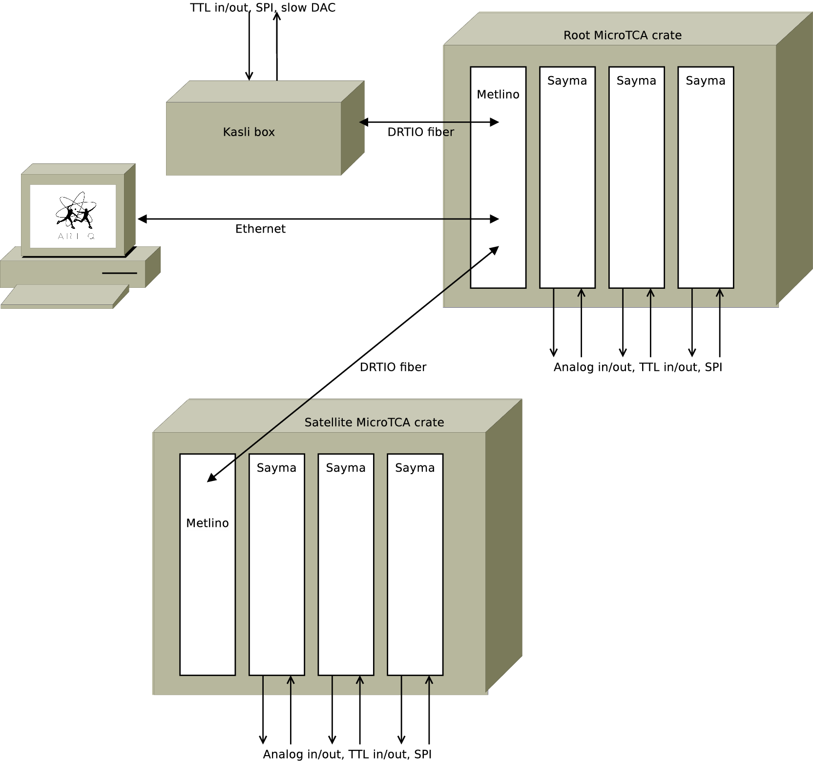

Sinara is an open-source hardware ecosystem originally designed for use in quantum physics experiments running the [ARTIQ](https://m-labs.hk/artiq/) control software. It is licensed under CERN OHL v1.2.

Control electronics used in many trapped-ion and other quantum physics experiments suffers from a number of problems. In general, an ad-hoc solution is hastily put together in-house without enough consideration
about good design, reproducibility, testing and documentation. This makes those systems unreliable, fragile, and difficult to use and maintain. It also duplicates work in different laboratories. In
addition, the performance and features of the existing systems (e.g. regarding pulse shaping abilities) is becoming insufficient for some experiments.

To alleviate those problems, Sinara aims to be:

- high-quality
- simple to use and "turn-key"
- reproducible and open
- flexible and modular
- well tested
- well supported by the ARTIQ control software

To see how Sinara can be used in your labs, take a look at our [case studies](CaseStudies) showing Sinara in Action.

Sinara is currently developed by a [collaboration](team) including M-Labs, Warsaw University of Technology (WUT), US Army Research Laboratory (ARL), the University of Oxford, the University of Maryland and NIST. The majority of the hardware was designed by WUT. The work was funded by ARL, Duke University, the University of Oxford, and the University of Freiburg.

_Currently, much of this hardware is at the prototyping stage._ Information about the status of the various hardware projects making up Sinara can be found [here](Status). Advice about purchasing Sinara hardware can be found [here](Purchasing).

# Overview

Following the ARTIQ model, an experiment consists of a core device (master) -- typically either a [Metlino](Metlino) or [Kasli](Kasli) -- controlling multiple slave devices in real time using ARTIQ's [distributed real-time IO](https://github.com/m-labs/artiq/wiki/DRTIO) (DRTIO) protocol. DRTIO provides both gigabit communication links and time distribution over copper cable or optical fibres. It synchronises all device clocks, ensuring they have deterministic phase relationships, and enables nanosecond timing resolution for input and output events across all devices in the experiment. More detailed information about communication between devices and time distribution inside Sinara can be found [here](SinaraClocking).

Sinara uses two main form factors for hardware requiring real-time control: microTCA (uTCA) and Eurocard Extension Modules (EEM). Non real-time hardware is typically connected to the host PC using ethernet.

MicroTCA (uTCA) is Sinara's preferred form factor for high performance hardware with high-speed data converters requiring deterministic phase control, such as the [_Sayma_](Sayma) Smart Arbitrary Waveform Generator (SAWG). Information about uTCA hardware, including a list of parts needed to build a Sinara uTCA crate can be found [here](uTCA). 

EEMs provide a lower cost, simpler platform than uTCA for hardware that requires real-time control, but not bandwidth or complexity of uTCA hardware.

Extension modules connect to a carrier, such as [Kasli](Kasli) or the [VHDCI carrier](VHDCICarrier), which provides power and DRTIO. They are designed to be mounted either in stand-alone enclosures, or in a rack with a carrier, and connect to the carrier via ribbon cable. More details about the extension module standard can be found [here](EEM).

uTCA hardware interfaces with the extension modules either directly, using a [VHDCI carrier](VHDCICarrier), or indirectly, using a [Kasli](Kasli) DRTIO slave.

To do: add diagrams showing example hardware configurations to give prospective users an idea of how it all works.  e.g:

1. Simple Kasli rack
2. Simple uTCA rack
3. More complex system with uTCA + Kasli. 

## Talks and Posters

* [Greg's NACTI poster](talks/poster_NACTI.pdf)
* [Paweł's master thesis proposal talk](talks/pawel_kasli_mgr2.pdf)

## MicroTCA hardware

An overview of uTCA in Sinara can be found [here](uTCA), for more detailed information on specific topics, see the links below.

* [_uTCA Chassis_](uTCA_Chassis)
* [_Metlino_](Metlino): uTCA MCH (rack master device)
* [_Sayma_](Sayma): 8 channel 2.4GSPS Smart Arbitrary Waveform Generator
* [_Baikal_](Baikal): rack clock distribution module
* [Clock generation mezzanines](ClockMezzanines)
* [Sayma analogue front-end mezzanines](SaymaAFE)
* [uTCA misc](uTCAMisc): mainly adapters and test harnesses

## Kasli and extensions

Information about the Eurocard Extension Module (EEM) standard can be found [here](EEM).

### Carriers

* [VHDCI carrier](VHDCICarrier)
* [Kasli](Kasli)

### Extension modules

* [DIO_BNC](DIO_BNC): digital IO on BNCs
* [DIO_SMA](DIO_SMA): digital IO on SMAs
* [DIO_RJ45](DIO_RJ45): LVDS on RJ45s
* [_Zotino_](Zotino): 32-channel DAC
* [_Sampler_](Sampler): 8-channel ADC
* [_Grabber_](Grabber): Camera Link
* [_Urukul_](Urukul): DDS
* [_Mirny_](Mirny): microwave synthesiser
* [_Clocker_](Clocker): clock buffer
* [_Stamper_](Stamper): TDC
* [_Thermostat_](Thermostat): Temperature Controller

## Support hardware

Other supporting hardware, not requiring real-time control from the ARTIQ master:

* [Booster](Booster): RF Power Amplifier

## Adapters and breakout

* [SATA to SFP](SATA-SFP)
* [BNC to IDC](BNC-IDC)
* [HD68 to IDC](HD68-IDC)

## Misc

A list of hardware projects that haven't yet become professionally-designed parts of Sinara can be found [here](PlannedHardware). These projects range from ideas waiting for further specification/funding to well-advanced physicist-designed projects that haven't been professionally developed/tested yet.

# Project structure and development

Development discussions take place on two forums: the GitHub issue tracker for well-defined actionable items; and the [ARTIQ mailing list](https://ssl.serverraum.org/lists/listinfo/artiq) for more vague questions, general brainstorming, new hardware proposals, discussions about funding, and so forth. Project milestones are listed [here](https://github.com/m-labs/sinara/milestones). 

Two main CAD tools are used for PCB design within Sinara: _Mentor Graphics Xpedition Enterprise_ and _Altium Designer_. Xpedition is preferred for more complex designs, such as the uTCA hardware. Altium is used for simpler designs, in particular those intended to be modifiable by the users (physicists). 

To allow easy sharing of dependencies between projects developed with the same CAD tools, projects are organised first by the CAD tool used, and then by the project hierarchy. Projects developed in Xpedition are stored in the ARTIQ_EE directory, while Altium projects are stored in the ARTIQ_ALTIUM directory.