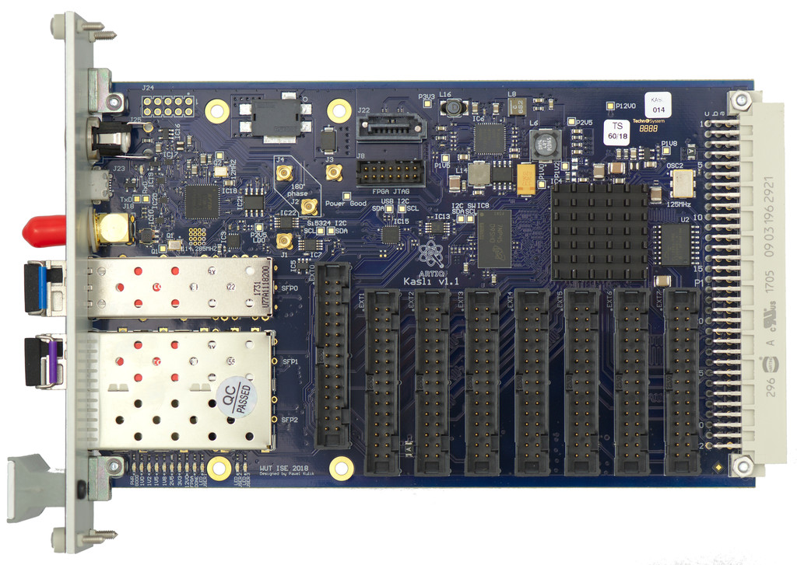

# This page is no longer updated. Please visit https://github.com/sinara-hw/Kasli/wiki for recent updates.

# Kasli EEM controller

## Overview

Kasli is low-cost FPGA carrier, capable of controlling at least 8 [Eurocard extension modules](EEM).
It can act as either an ARTIQ master, or as a slave connected to the master via DRTIO.

Kasli offers:

* XC7A100T-2FGG484I FPGA, DDR3 RAM, SPI flash
* a clock recovery and distribution network
* USB connectivity with four virtual ports
* four high speed 6 GB/s transcievers for Ethernet and DRTIO, and
* up to 12 EEM ports for Eurocard Extension modules

[Master thesis proposal talk](talks/pawel_kasli_mgr2.pdf) by Paweł.

## Specification/initial design

Kasli is compatible with the Sinara [EEM standard](EEM). Its design is based on the discussion in [issue #129](https://github.com/m-labs/sinara/issues/129).

Front panel connections:
* 3 SFP connectors for Ethernet (if Kasli is the master) and DRTIO (one upstream, two downstream). Each with a LED.
  * SFP1: [Ethernet](https://github.com/m-labs/misoc/issues/54) in stand-alone (if Kasli is master), DRTIO upstream otherwise
  * SFP2: DRTIO downstream
  * SFP3: DRTIO downstream or special purpose.
* 1 micro USB for JTAG, serial console, I2C
* 1 SMA to the clock recovery and clock distribution chip used as RTIO reference clock input in master/stand-alone mode (10 dBm sine/square)
* FBarrel connector for +12V power, used for Kasli and passed through to the EEM IDCs. Compatible with locking barrel connectors for increased ruggedness.

## EEM connectivity

* Eight EEM (0-7) available as 30 pin IDC connectors on Kasli
* Four EEM (8-11) available on the 96 pin DIN 41612 connector

## Rear connections

* DIN 41612 96 position connector to backplane.

## Rack-internal connections

* Hosts 8 EEMs using standard EEM headers
* Up to 4 EEMs via backplane
* 1 SATA (wired as master/host) connected to a transciever
  * SATA1 ("host" pinout, not "disk"/"reversed"): DRTIO downstream or special purpose
* 4 MMCX outputs with the RTIO reference frequency
* Port 4 of the FT4232H available on an optional pin header
* FPGA JTAG
* 3 USER_LEDs

# Accessories

## Standalone

* 1000BASE SFP module for Ethernet connection. One of the following:
  * 1000BASE-BX-U and 1000BASE-BX-D and LC-LC fiber and SFP slot in upstream switch port
  * 1000BASE-T GBIC, RJ45 and RJ45 connection (or another GBIC plus SFP slot) in upstream switch
  * Direct attach cable (twinax), and SFP slot in upstream switch
  * Pair of 1000BASE-LX modules plus LC-LC duplex fiber and SFP slot in switch
* Ethernet switch if not already present
* 12V Power supply, >=5A, with barrel connector, 5.5 mm OD, 2.5 mm ID, can be locking
* Several 30 pin IDC cables to connect EEM modules
* 3U Subrack/crate
* Computer and ARTIQ
