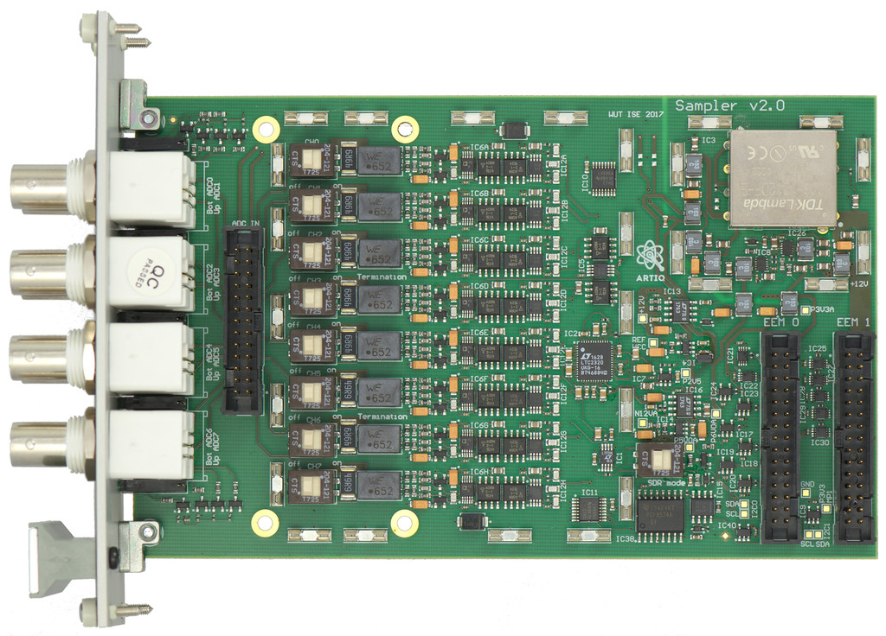

**New revision of the module and updated documentation are available here:**
https://github.com/sinara-foundation/Sampler/wiki

Sampler is an 8-channel, 16-bit ADC EEM with an update rate of up to 1.5MSPS (all channels simultaneously). It has low-noise differential front end with a digitally programmable gain, providing full-scale input ranges between +-10mV (G=1000) and +-10V (G=1).

**Note that this page describes the forthcoming Sampler v2.0, rather than the current (soon-to-be-obsolete) v1.1.**

# Overview

- **Current hardware revision**: v1.1 (first prototype), v2.0 forthcoming
- **Cost**: €500 (estimate)
- **Width**: 4HP
- **Channel count**: 8
- **Resolution**: 16-bit
- **Sample-rate**: up to 1.5MSMs (per channel in *basic* mode, or simultaneously on all channels in *fast* mode)
- **Bandwidth**: 200kHz -6dB bandwidth for G={1, 10, 100}, 90kHz for G=1000
- **Input ranges**: +-10V (G=1), +-1V (G=10), +-100mV (G=100), +-10mV (G=1000)
- **DC input impedance**:
  - Termination off: 100k from input signal and ground connections to PCB ground
  - Termination on: signal 50Ohm terminated to PCB ground, input ground shorted to PCB ground
- **ADC**: [LTC2320-16](http://cds.linear.com/docs/en/datasheet/232016fb.pdf)
- **PGIA**: [AD8253](http://www.analog.com/media/en/technical-documentation/data-sheets/AD8253.pdf)
- **EEM connectors**: power and digital communication supplied by a 1 EEM connector in *basic* mode or 2 EEM connectors in *fast* mode.
- **Power consumption**: ?

# Modes of operation

Sampler can be operated either in *basic* mode as a standard SPI EEM using a single [EEM connector](EEM#eem-connectors) (EEM0), or in *fast* mode via a source-synchronous LVDS interface and 2 [EEM connectors](EEM#eem-connectors) (EEM0-EEM1).

In *basic* mode, the channels must be read out sequentially, in increasing order. The maximum SPI clock is limited by the round-trip delay in the cabling used to connect Sampler to the master. With a 20 MHz SPI read clock (25ns round trip plus setup), we get one sample one each channel per 6.9us (30ns tCONVH + 450ns tCONV + 8 channels * 16 bits * 50ns).

*Fast* mode allows all ADC channels to be read out simultaneously at 1.5MSPs via a source-synchronous interface. This is used in the Kasli-Sampler-Urukul "[NU](https://github.com/m-labs/nu-servo)" laser intensity servo.

EEM connector usage:

Pin | EEM0 | EEM1 (*fast* mode only)
--- | ---|---
0 | ADC-SCK | ADC-CLKOUT
1 | NC | ADC-SDOB
2 | ADC-SDOA | ADC-SDOC
3 | ADC-CNV | ADC-SDOD
4 | PGIA-SCK | NC 
5 | PGIA-MOSI | NC
6 | PGIA-MISO | NC
7 | PGIA-CS | NC

"PGIA" refers to the front-end programmable-gain instrumentation amplifiers, which are controlled over SPI via a shift register.

#  Tests and characterisation

**To do**: check power handling of termination resistors!

Tests performed using Sampler Rev 1.1 prototype hardware. See [issue 226](https://github.com/m-labs/sinara/issues/226) for further details. Further tests will be done on the Rev 2 hardware.

Unless stated otherwise, all measurements use:
- 200kHz ADC clock
- Input termination off for signals connected directly to a voltage source, termination on for "floating" inputs
- PGAI G=1

## Bandwidth

- Drive an input (termination off) from a signal generator.
- Scan the signal frequency to measure the -6dB frequency on the ADC.
- The sample rate was 125kSPS, so the signal frequency was above the Nyquist frequency for most gain settings.

### Small-signal bandwidth
- Signal was nominally -28dBFS=1Vpp/G (there was a slight error due to the ADC reference gain being incorrect in this hardware revision).

Gain | Small-signal BW (kHz)
---  | --- 
1 |  206
10 | 207
100 | 195
1000 | 87

### Large-signal bandwidth

- We made the following measurements, which confirm that the large-signal bandwidth is the same as the small-signal bandwidth to within the measurement accuracy for gains of 1 and 10.
  - G=10, 1Vpp=-8.1dBFS: 213kHz
  - G=10, 2Vpp=-1.2dBFS: 212kHz
  - G=1, 10Vpp=-8.1dBFS: 214kHz

## Large-signal settling time

- This measurement is still "to do"; we didn't end up measuring the settling time, as we didn't have a sufficiently fast-settling voltage source to hand.
- Apply 1kHz, 50% duty-cycle square-wave to input
- Measure settling time as a function of input signal level

### G=1
Input level | to 0.1% (us) | to 1 LSB (us)
---|---|---
22mVpp | ? | ?
220mVpp | |
2.2mVpp | | 
10Vpp | | 

### G=1000
...

## Noise floor

- Sample rate for this measurement was 200kHz, measurement bin width was 3Hz (65k samples)
- We measured the noise spectrum both for a terminated input (0V input) and (using batteries as a low-noise voltage source) for signals close to full-scale. No significant difference observed between the two cases. Data below are all for terminated (0V) inputs.
- No spurs seen above the noise floor at any frequency (e.g. no SMPS spurs seen)
- Noise spectrum is white once DC offset was subtracted
- Measure noise floor as a function of gain

gain | LSB RMS | µV RMS | nV/rtHz
--- | --- | --- | ---
  1 | 1.3 | 420 | TBD
 10 | 1.4 | 44 | TBD
100 | 3.6 | 11 | TBD
1000 | 14.3 | 4.4 | TBD

## Channel-channel cross-talk

DC cross-talk measurement:
- Input A: apply +-17V DC, termination off. NB this voltage is clipped by the protection diodes, but was chosen to really stress-test the design.
- Input B: termination on measure signal level
- With input B G=1, voltage applied to input A makes <1LSB change in level measured at input B. DC cross-talk is thus <96dB.
- **To do**: re-measure DC cross-talk at G=1k

AC cross-talk measurement:
- Gain was the same on all channels.
- Apply 50kHz, 10Vpp (-8.8dBFS) signal to one channel. NB this saturates the PGIA for G>1!
- Measure signal on the adjacent channel as a function of PGIA gain
- Termination is on for the driven channel, but off for all other channels
- Note that the lack of dependence of the cross-talk on PGIA gain suggests that the cross-talk is dominated by pickup before the PGIA -- most-likely in the BNC connector.

Gain | Measured signal (dBFS) | Cross-talk (dBc)
---|---|---
1 | -87 | -79.2
10 |  -67 | -78.2
100 | -46 | -77.2
1000 | -29 | -81.2
 
- With the termination on for all channels, we find:

Gain | Measured signal (dBFS) | Cross-talk (dBc)
---|---|---
1 | <-130 | <-121
10 |  -111.5 | -123
100 | -93.7 | -124.9
1000 | -72.2 | -123.4

## Common-mode rejection ratio (CMMR)

- Short input ground and signal together for one channel
- Apply sinewave to input signal/ground
- Measure the signal level seen by the ADC

### G=1, signal ~2Vpp  (-22dBFS)

Freq [kHz] | measured signal level [dBFS] | CMRR (dB)
---   | --- | ---
0.01 | <-120 | >-98
0.1 | < -120 | >-98
1 | <-120 | >-98
10 | -109 | - 87
100 | -87 | -55
1000 | -105 | -83
10000 | -108 | -85

### G=100, signal ~2Vpp  (+18dBFS)

Freq [kHz] | measured signal level [dBFS]  | CMRR (dB)
---   | --- | ---
0.01 | <-110 |  >-118 | 
0.1 |-98 | -116
1 | -88 | - 106
10 | -70 | - 88
100 | -50 | - 68
1000 | -80 | - 98
10000 | <-100 | >-118

## Harmonics

- 25kHz signal applied to input
- measure the level of the second harmonic (50kHz) and third harmonic (75kHz) as a function of input signal level.

Input level | Second harmonic | Third harmonic
--- | --- | ---
0.1Vpp (-48dBFs) | -51dBc | 
1Vpp (-28dBFs) | -69dBc | 
10Vpp (-8dBFs) | -58.8dBc |
