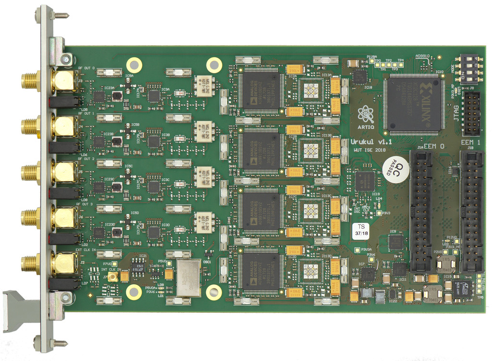

This WIki is no longer supported. It was moved here: https://github.com/sinara-hw/Urukul/wiki

# Urukul 4 channel GS/s DDS EEM

Urukul is a 4 channel DDS-based frequency synthesizer for the EEM form factor.
It provides sub-Hz frequency resolution, controlled phase steps, and accurate
output amplitude control.

## Details, Specification, and typical performance data

### DDS
* Two variants of Urukul are available with different DDS chips:
  [AD9912](http://www.analog.com/media/en/technical-documentation/data-sheets/AD9912.pdf)
  and
  [AD9910](http://www.analog.com/media/en/technical-documentation/data-sheets/AD9910.pdf)
* Output frequency (-3 dB): <1 to >400 MHz
* Frequency resolution: ~4 µHz (48 bit, AD9912), ~0.25 Hz (32 bit, AD9910, but see also [#210](https://github.com/m-labs/sinara/issues/210) for an extension of the frequency resolution using the DRG)
* Frequency update rate using the single-width SPI bus: > 500 kHz burst
  aggregate, TBC
* Phase offset resolution: 14 bit (AD9912), 16 bit (AD9910)
* Digital amplitude (ASF) resolution: 14 bit (AD9910 only)
* DAC full scale current resolution: 10 bit (AD9912), 8 bit (AD9910)
* DAC full scale current slew rate: ~6 mA/20 µs, 100 ns/LSB (AD9912) [#205](https://github.com/m-labs/sinara/issues/205)
* Temporal resolution, FTW/POW/ASF updates: 4 ns (IO_UPDATE on a SERDES TTLOut) (TBC)
* OSK: not supported
* DRG control pins: not supported
* Profile (using the AD9910 PROFILE pins): ganged and exposed in the shift register

### RF signal chain
* Anti-Aliasing: The [lowpass](https://ww2.minicircuits.com/pdfs/LFCN-320.pdf)
  can be replaced by a custom discrete filter. This allows usage of the second
  or third Nyquist zones.
* [Digital step attenuator](http://www.analog.com/media/en/technical-documentation/data-sheets/hmc542b.pdf) resolution: 0.5 dB
* Digital step attenuator range: 0 to -31.5 dB
* Digital step attenuator glitch duration: 100 ns
* Nominal max output power (1dB compression from expected attenuator/ASF/FSC setting due to [pre-amplifier](https://www.minicircuits.com/pdfs/ERA-3+.pdf)): 10 dBm
* Temporal resolution [RF switch](http://www.analog.com/media/en/technical-documentation/data-sheets/hmc349alp4c.pdf): 1 ns (limited by FPGA OSERDES/ARTIQ TTLOut
  resolution)
* RF switch speed: 100 ns rise to 90 %
* RF switch isolation: 70 dB
* Jitter RF switch: < 1 ns, TBC
* RF switches controlled by dedicated LVDS lines on EEM1 and by shift register (logical OR)
* Crosstalk: -84 dB with victim RF switch open, -110 dB with victim switch
  closed
* Cross-channel-intermodulation: -90 dB
* Harmonics: at 6 dBm: -40 dB, -54 dB; at 10.5 dBm: -34 dB, -28 dB

### Noise/Stability
* Phase noise/stability (100 MHz ref in, 1 GHz DDS PLL, 81 MHz output):
  * 0.1 Hz: -85 dBc/Hz
  * 1 Hz: -95 dBc/Hz
  * 10 Hz: -107 dBc/Hz
  * 100 Hz: -116 dBc/Hz
  * 1 kHz: -126 dBc/Hz
  * 10 kHz: -133 dBc/Hz
  * 100 kHz: -135 dBc/Hz
  * 1 MHz: -128 dBc/Hz
  * 10 MHz: -149 dBc/Hz
* AM-to-PM coefficient: < 5 deg/dB (TBC)
* Amplitude temperature coefficient: < 0.01 dB/K TBC
* Amplitude noise/stability: TBD
* RF switch turn-on chirp: <0.1 deg/s (excluding the first ~µs)

### Clock input
* Input frequency: 10 MHz to 1 GHz (TBC, depending on PLL/clocking configuration)
* [Input power](https://www.silabs.com/documents/public/data-sheets/Si53312.pdf): 10 dBm nominal (TBD to TBD dBm)
* Source: External SMA, internal MMCX (from Kasli or Clocker), or on-board XO
* Selection between MMCX and XO: on board jumpers
* Selection between MMCX/XO and SMA: software
* Default design is 1 GHz DDS clock from 125 MHz or 100 MHz reference frequency input using the DDS PLLs
* On-board divider divides the input clock by 1, 2 or 4 (programmed by the CPLD). Default is 1 for the AD9912, 4 for the AD9910.
* AD9912 PLL 11 - 200 MHz (2.75 - 800 with 1/4 divider), 4x - 66x ratio even
* AD9910 PLL accepts clocks between 3.2MHz and 60MHz (12.8 and 240 with divider), PLL multiplication factors between 12 and 127 (48 and 508 with divider)

### Environmental
* Air flow: > 50cm/s (from thermal simulation,
  [#321](https://github.com/m-labs/sinara/issues/321#issuecomment-331705477)), TBD
* Power consumption: 7 W (AD9910)/6.5 W (AD9912) with 1 GHz PLL, 4x400 MHz, 10.5 dBm, 52 C DDS temperature sitting on bench

### Front panel

* Each channel:
  * SMA RF output
  * Green LED indicating RF output enabled
  * Red LED indicating DDS sychronization/PLL error or software-controlled
    function
* One SMA for the reference frequency input, up to 1 GHz
* Red LED: over temperature
* Green LED: power good

## Synchronization

Urukul has deterministic phase control in the sense that phase jumps are well
defined and deterministic in their jump size.

Phase control beyond that level requires aligning the synchronization clock
phase to the other DDSs on a card and more importantly to the RTIO timebase.

Different strategies will be evaluated:

### AD9912 RESET

DDS_RESET provides a way to deterministically reset all AD9912 DDS SYNC_CLK
dividers (see a corresponding [ADI
discussion](https://ez.analog.com/docs/DOC-14472)). It remains to be seen
whether this also works when using the PLL. If it does not, the AD9912 variant
can only made absolutely synchronous when not using the PLL.

DDS_RESET needs to be well timed w.r.t. DDS SYSCLK (meet S/H). That requires
determination of the timing t_RESET of DDS_RESET w.r.t. DDS
REFCLK/SYSCLK. This which will need to be measured manually, computed using
cable lengths and empirical offsets, or always found empirically using a
measurement of phase update determinism when scanning a delay.
From the timing t_RESET the proper timing t_UPDATE or IO_UPDATE w.r.t. SYNCCLK
can be inferred.
The latter should only be required once for a given hardware
design.

### AD9910 active SYNC

Using the [AD9910 SYNC
circuitry](http://www.analog.com/media/en/technical-documentation/data-sheets/AD9910.pdf#page=47),
a marker signal (SYNC) is distributed to all DDS that resets their SYNCCLK
dividers. If SYNC originates from the FPGA (Kasli/Sayma/Metlino), then the
delay of SYNC_OUT w.r.t. REFCLK/SYSCLK needs to be reproducibly adjusted. This
is done using the DDS-internal delays seeded with a persistently stored initial
value (start with last value, optimize it, and store it for next optimization
after reboot).

Given this synchronization the proper timing t_UPDATE or IO_UPDATE w.r.t. SYNCCLK
can be inferred. The latter should only be required once for a given hardware
design.

### AD9910 passive SYNC

In this mode SYNC would be driven by the first DDS and emitted from Urukul to
the FPGA. On the FPGA it would be used to re-time IO_UPDATE (or PROFILE) with
respect to SYNC CLK and thus SYSCLK. The requirement on reproducibly adjusting
the latency (from RTIO clock to DDS/SYNC domain) are similar to AD9910 active
SYNC with the exception that the FPGA needs to perform delay adjustment as well
now.

This mode does not place the IO_UPDATE timing reproducibly w.r.t. RTIO
clock. It only ensures that IO_UPDATE/PROFILE always meets S/H w.r.t. DDS
SYNCCLK.

## Urukul CPLD

The IO and logic router on Urukul controls the SPI buses, multiplexes the
different chips, and implements the shift register for control of miscellaneous
functionality.

Its implementation and functionality are documented in the [CPLD source code](https://github.com/m-labs/urukul/blob/master/urukul.py).

## EEM IO

Urukul operates from one or two EEM connectors. In standard SPI mode, the complete Urukul functionality can be accessed using only that interface. Standard SPI mode only needs the second EEM connector to interface with high resolution RF switching and synchronization signals. NU-Servo mode always requires two EEM connectors.Details are documented in the [CPLD source code](https://github.com/m-labs/urukul/blob/master/urukul.py).

## [Sampler](Sampler) to [Urukul](Urukul) servo

Urukul can be integrated with Sampler to form a multi-channel, multi-profile
digital servo controller.
See [SamplerUrukulServo](https://github.com/m-labs/nu-servo) for details.

## Misc DDS links

* 
* [Some AD9912 noise/stability measurements](http://www.rubiola.org/pdf-slides/2012C-IFCS-DDS.pdf)
