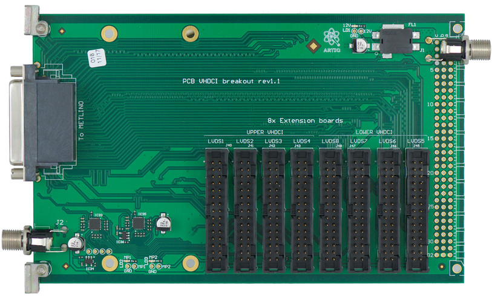

# The Wiki is no more updated. For up-to-date version go her: https://github.com/sinara-hw/VHDCI_Carrier/wiki/

# VHDCI Carrier Overview 

This carrier is an adapter to allow 8 [EEM](https://github.com/m-labs/sinara/wiki/EEM) to be driven from 2 VDHCI connectors. 

## ARTIQ PCBs with VHDCI 

* __KC705__ and __[FMC-DIO-32ch-LVDS-a](https://www.ohwr.org/projects/fmc-dio-32chlvdsa/wiki)__ plus a VHDCI cable (no integrated termination).

* __[PCB_Metlino](Metlino)__ serves as the ARTIQ Core Device in uTCA crates. Metlino has a pair of VHDCI connectors on its front panel that are driven directly by the Metlino FPGA (low latency).

* __[PCB_Sayma_AMC](Sayma)__ has an LPC FMC connector and can control four EEMs via FMC-DIO-32ch-LVDS-a, a VHDCI cable and VHDCI-Carrier.

## VHDCI Carrier Specification

The design files are located [here](https://github.com/m-labs/sinara/tree/master/ARTIQ_ALTIUM/Kasli/3U/PCB_3U_VHDCI_breakout).
This carrier is compatible with Sinara [EEM](https://github.com/m-labs/sinara/wiki/EEM) peripherals.

Front panel connections:
* Two VHDCI connectors, each routed to 4 extension headers.
* I2C from each VHDCI routed to TCA9548 8-ch multiplexer - one channel to each of the 4 extension headers and one to and EEPROM

Rear connections:
* EEM Carriers require a +12 V supply (60 W); power barrel connector is 2.50 mm ID (0.098"), 5.50 mm OD (0.217") (p/n CUI PJ-102BH), positive potential on center conductor. The same type of connector is installed on front and rear side.
* The 96 pin DIN connector can be mounted optionally to supply 12V.

Internal connections:
* 8 IDC connectors for [EEM](https://github.com/m-labs/sinara/wiki/EEM)
